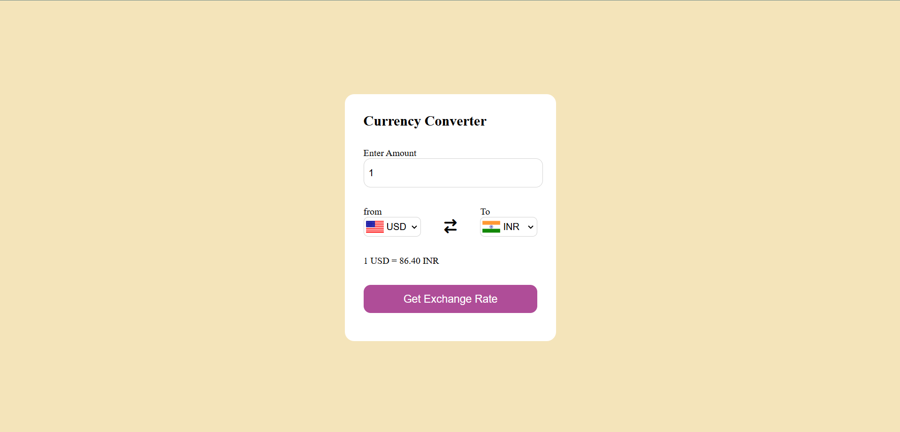

# 💱 Currency Converter Web App

A simple and responsive currency converter web application built using **HTML**, **CSS**, and **JavaScript**, which fetches real-time exchange rates using a public API.

## 🚀 Features

- 🔄 Convert between any two currencies
- 🌐 Uses real-time exchange rates via API
- 📱 Responsive design for desktop and mobile
- ✨ Clean and simple user interface

## 🛠️ Tech Stack

- **HTML5**
- **CSS3**
- **JavaScript (Vanilla JS)**
- **Exchange Rate API** 

## 📷 Screenshots

 

## 🔧 How It Works

1. User selects a source and target currency.
2. Inputs the amount to convert.
3. Clicks the "Convert" button.
4. JavaScript fetches the current exchange rate from the API.
5. Displays the converted value on the screen.

